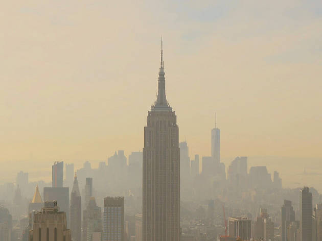

 <h3>Darwin Keung | Felix Tran | Jessie Wong | Vince  Tam</h3> 

----------

# Overview 

<iframe width="853" height="480" src="https://www.youtube.com/embed/vtIguH0EzTo?rel=0" frameborder="0" allow="accelerometer; autoplay; encrypted-media; gyroscope; picture-in-picture" allowfullscreen></iframe>

# Introduction

Asthma is a major public health concern both in New York City and nationally across the United States. According to CDC's Behaviorial Risk Factor Surveillance System (BRFSS) data in 2012, approximately 1.4 million New York adults and 314,000 children (under the age of 18) reported having asthma. While data has shown that in the last 10 years, annual asthma related deaths have decreased significantly by over 20%, the disparities in air quality and asthma rates across neighborhoods should be addressed. 

The objective of our project is to further understand the air quality across the different neighborhoods in New York City, through looking at different pollutants and their levels. There are multiple air exposures both outdoor and indoor that can in combination, exacerbate asthma conditions and prevalence among different groups, particularly vulnerable children and elderly. In addition, we hope to explore the relationship between air quality, poverty, and asthma-related health outcomes.    

# Data Source

The data was obtained from the [NYC Environment & Health Data Portal](http://a816-dohbesp.nyc.gov/IndicatorPublic/PublicTracking.aspx) and the [NYC OpenData](https://data.cityofnewyork.us/Environment/Air-Quality/c3uy-2p5r/data). 

The New York City neighborhood boundaries were defined by the [United Hospital Fund Neighorhood Index](http://a816-dohbesp.nyc.gov/IndicatorPublic/EPHTPDF/uhf42.pdf). There are a total of 42 neighorboods across the 5 boroughs—Bronx, Staten Island, Queens, Manhattan, and Brooklyn.    

From the air quality data, we focused on 5 outdoor air quality pollutants:

- Fine Particulate Matter (PM2.5)
- Sulfur Dioxide (SO2)
- Benzene
- Formaldehyde
- Nitrogen Oxide (NOx)

In addition to outdoor air pollutants, we wanted to explore the indoor exposure to mold that may contribute to the prevalence of asthma. Data collected from the New York City Community Health Survey of the percentage of adults reporting mold in their homes were used. The percentages were collected and calculated based off the number of adults reporting damp spots or mold in at least one room in their building, excluding the bathroom, in the past 30 days. 

The 3 health outcomes of interest are asthma-related ED visits, hospitalizations, and deaths for adults and for children (under the age of 18).

# Analyses
Research questions that we were interested in exploring in our analyses: 

1) What is the distribution of asthma rates across neighborhoods?
2) What is the relationship between pollution levels and the poverty level of the neighborhood? 
3) How do the rates of asthma-related ED visits, hospitalizations, and deaths between different neighborhoods compare? Are there any indication of disparities?
4) What is the impact of the collective exposure to high levels of all the pollutants in comparison to exposure to them individually?
5) How does the indoor exposure to mold compare to the outdoor pollution exposure?

**Air Pollutants:** 

Based on our density plots found in the **Pollution Density** tab, we see varying distribution of the different outdoor air pollutants. Among the different boroughs, Queens and Staten Island remain on the lower end of the concentration levels for all 5 pollutants examined. Manhattan had the widest distribution of concentration levels, illustrating that there is a wider spectrum of high pollutation levels in certain neighborhoods and low levels in others. Bronx and Brooklyn's pollution levels stayed in the middle ranges in comparison to the other boroughs, however, there is significant peaking for certain pollutants, including Benzene for Bronx.   

**Asthma-Related Health Outcomes:** 

There are neigborhood differences in the rates of asthma-related emergency department visits, hospitalizations, and deaths. From the 2005-2007 and 2009-2011 data, we consistently found that Bronx had the highest rates of emergency department visits and hospitalizaations for adults and children (under the age of 18), where it is approximately double the rate of the other boroughs. In addition to comparison between boroughs, differences and similarities in outcomes within boroughs were also evaluated. When we stratified within neighborhoods belonging to the same boroughs, there were significant disparities found. For emergency department visits in Manhattan (2005-2007), East Harlem had a rate of 143.9 per 100,000 adults and Central Harlem had a rate of 156.1 per 100,000 adults compared to the rest of Manhattan that had a rate ranging from 8.5 to 46. We observed similar gaps across the other boroughs as well.    

**Mold Complaints in Homes:** 

For the data on mold complaints in homes, there were 9 neighborhoods with unavailable data. However 3 out of the 5 neighborhoods with the highest mold reports were located in Bronx. We took into account that since the data is based on self-report, there may be potentially cases that go unreported. It is possible that if there is reporting bias across neighborhoods in the different boroughs, this may underestimate the differences and level of mold in homes. 

**Linear Regression:**

After visualizing the distribution pollutants across neighborhoods, a linear regression is performed on PM 2.5-attributable ED visits among NYC neighborhoods by PM 2.5 levels and neighborhood poverty. The code used for this section can be found
[here](https://github.com/darwinthebeagle/asthma_nyc/blob/master/Linear_regression.Rmd). For both child and adult rates of ED vists, levels of neighborhood PM 2.5 air pollution do not appear to have a statistically significant effect after adjusting for 
neighborhood poverty. Rather, neighborhood poverty is strongly associated with 
ED visits after adjusting for PM 2.5 air levels. For every 1 percentage point 
increase in the proportion of people living in poverty in a particular 
neighborhood, that neighborhood on average experiences an increase of 3.46 ED
visits for PM 2.5-attributable asthma per every 100,000 adults and an increase 
of 5.66 ED visits for PM 2.5-attributable asthma per every 100,000 children. 

# Conclusions

More research and analyses must be conducted to address the asthma disparities across neighborhoods in New York City.  

